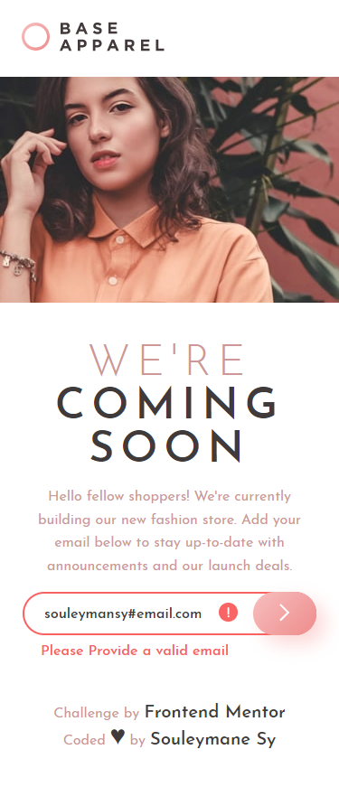

# Frontend Mentor - Base Apparel coming soon page

## Welcome! 👋

Thanks for checking out this front-end coding challenge.

This is a solution to the [Base Apparel coming soon page challenge on Frontend Mentor](https://www.frontendmentor.io/challenges/base-apparel-coming-soon-page-5d46b47f8db8a7063f9331a0).

[Frontend Mentor](https://www.frontendmentor.io) challenges help you improve your coding skills by building realistic projects.

## The challenge

The challenge is to build out this coming soon page and get it looking as close to the design as possible.

Your users should be able to:

- View the optimal layout for the site depending on their device's screen size
- See hover states for all interactive elements on the page
- Receive an error message when the `form` is submitted if:
  - The `input` field is empty
  - The email address is not formatted correctly

### Screenshot

This is the Screenshot of the projects a made!

### Mobile Screenshot

### Mobile Active Screenshot

### Desktops Screenshot

### Desktop Active Screenshot

### Links

- Solution URL: [Add solution URL here](https://your-solution-url.com)
- Live Site URL: [Add live site URL here](https://your-live-site-url.com)

## My process

Made this projects with HTML5 and SASS !!!

### Built with

- Semantic HTML5 markup
- SASS
- CSS custom properties
- Flexbox
- CSS Grid
- Mobile-first workflow
- npm

## Author

- GitHub - [Souleymane Sy](https://github.com/SouleymaneSy7)
- Frontend Mentor - [@SouleymaneSy7](https://www.frontendmentor.io/profile/SouleymaneSy7)
- Twitter - [@Souleymanesy43](https://twitter.com/Souleymanesy43)
